# ROS 2 Multi-Drone Simulation System - Teknik Rapor

[](https://docs.ros.org/en/humble/)
[](https://px4.io/)
[](https://gazebosim.org/)
[](https://www.python.org/)

## 📋 İçindekiler

1. [Özet](#özet)
2. [Kurulum Kılavuzu](#kurulum-kılavuzu)
3. [Sistem Mimarisi](#sistem-mimarisi)
4. [Görev Senaryoları](#görev-senaryoları)
5. [Görsel Dokümantasyon](#görsel-dokümantasyon)
6. [Test Sonuçları](#test-sonuçları)
7. [Sorun Giderme](#sorun-giderme)

---

## Özet

Bu proje, ROS 2 Humble, PX4 Autopilot ve Gazebo Harmonic kullanarak çoklu drone simülasyonu ve otomatik görev yönetimi sistemidir. Sistem, 4-6 drone'un eş zamanlı kontrolünü, formasyon uçuşunu, alan taramasını ve paralel görev yürütmeyi desteklemektedir.

### Temel Özellikler

- ✅ **Çoklu Drone Kontrolü**: 4-6 drone'un eş zamanlı yönetimi
- ✅ **Otomatik Formasyon**: Kare, çizgi ve üçgen formasyon desteği
- ✅ **Alan Tarama**: Grid pattern ile sistematik alan taraması
- ✅ **Paralel Görev Yürütme**: Threading ile eş zamanlı multi-mission desteği
- ✅ **Otomatik Başlatma**: Tek komutla tüm sistemin başlatılması
- ✅ **Gerçek Zamanlı Telemetri**: Konum, hız, batarya ve GPS takibi

---

## Kurulum Kılavuzu

### ADIM 1: Gerekli Kurulumlar (Gazebo Harmonic & Araçlar)

#### 1.1. Temel Araçların Kurulumu

```bash
sudo apt update
sudo apt install tmux expect git -y
```

#### 1.2. Gazebo Harmonic Kurulumu

Eski Gazebo Classic yerine yeni nesil Gazebo Harmonic kurulmalıdır:

```bash
sudo apt-get install lsb-release gnupg curl -y
sudo curl https://packages.osrfoundation.org/gazebo.gpg --output /usr/share/keyrings/pkgs-osrf-archive-keyring.gpg
echo "deb [arch=$(dpkg --print-architecture) signed-by=/usr/share/keyrings/pkgs-osrf-archive-keyring.gpg] http://packages.osrfoundation.org/gazebo/ubuntu-stable $(lsb_release -cs) main" | sudo tee /etc/apt/sources.list.d/gazebo-stable.list > /dev/null
sudo apt-get update
sudo apt-get install gz-harmonic -y
```

#### 1.3. Python Bağımlılıkları

```bash
pip3 install kconfiglib jinja2 jsonschema
```

#### 1.4. PX4 Autopilot Kurulumu ve Derleme

```bash
cd ~/PX4-Autopilot
make distclean
# Test için bir kez elle derle (sonra script yapacak)
make px4_sitl gz_x500
```

**Not**: İlk derleme 10-15 dakika sürebilir.

---

### ADIM 2: ROS 2 Çalışma Alanı ve px4_msgs

#### 2.1. Çalışma Alanı Oluşturma

```bash
mkdir -p ~/ros2_drone_ws/src
cd ~/ros2_drone_ws/src
```

#### 2.2. px4_msgs Paketini İndirme

```bash
git clone https://github.com/PX4/px4_msgs.git
```

#### 2.3. Derleme (Build)

```bash
cd ~/ros2_drone_ws
colcon build
```

#### 2.4. Ortamı Kaynaklama

```bash
source install/setup.bash
```

**Kalıcı kaynaklama için** `~/.bashrc` dosyasına ekleyin:

```bash
echo "source ~/ros2_drone_ws/install/setup.bash" >> ~/.bashrc
```

---

### ADIM 3: Otomasyon Scripti (baslat.sh)

`baslat.sh` scripti şunları otomatik olarak yapar:

- **Otomatik IP Tespiti**: Bilgisayarın ağ IP'sini bulur
- **Agresif Temizlik**: Arkada kalan zombi süreçleri öldürür
- **Güvenlik İptali**: NAV_DLL_ACT 0 vb. ile kumanda/GCS olmadan uçuş izni verir
- **Tmux Yönetimi**: Ekranı böler, Agent'ı ve 4 drone'u (1 Master GUI + 3 Slave Headless) başlatır

**Script'i çalıştırılabilir yapma:**

```bash
chmod +x ~/ros2_drone_ws/baslat.sh
```

**Dosya Konumu**: `~/ros2_drone_ws/baslat.sh`

Script detayları için `baslat.sh` dosyasına bakınız.

---

### ADIM 4: Python Kontrol Kodları

#### 4.1. Manuel Kontrol (multi_test.py)

İnteraktif drone kontrolü için:

```bash
cd ~/ros2_drone_ws
source /opt/ros/humble/setup.bash
source install/local_setup.bash
export RMW_IMPLEMENTATION=rmw_fastrtps_cpp
python3 src/multi_test.py
```

**Kullanım Örnekleri:**
- `0 0 0 -5` - Drone 0'ı (0, 0, -5) konumuna gönder
- `1 2 2 -5` - Drone 1'i (2, 2, -5) konumuna gönder
- `land 0` - Drone 0'a iniş emri ver
- `land all` - Tüm dronlara iniş emri ver
- `q` veya `exit` - Sistemi kapat

#### 4.2. Otomatik Görev Yönetimi (oto.py)

Paralel multi-mission görevleri için:

```bash
cd ~/ros2_drone_ws
source /opt/ros/humble/setup.bash
source install/local_setup.bash
export RMW_IMPLEMENTATION=rmw_fastrtps_cpp
python3 src/oto.py
```

**Görev Senaryoları:**
- **Grup A (0,1)**: Nesne Tespiti (Sabit Gözlem)
- **Grup B (2,3)**: Alan Tarama (Grid Pattern)
- **Grup C (4,5)**: Hedef İmha (Dalış Manevrası)

---

### ADIM 5: Sistem Başlatma

#### 5.1. Simülasyonu Başlatma

```bash
cd ~/ros2_drone_ws
./baslat.sh
```

#### 5.2. Kontrol Scriptini Çalıştırma

Simülasyon başladıktan 50 saniye sonra otomatik olarak Python kontrol penceresi açılır. Manuel başlatmak için:

```bash
# Yeni terminal
cd ~/ros2_drone_ws
source /opt/ros/humble/setup.bash
source install/local_setup.bash
export RMW_IMPLEMENTATION=rmw_fastrtps_cpp
python3 src/multi_test.py  # veya src/oto.py
```

---

## Sistem Mimarisi

### Bileşenler

```
┌─────────────────────────────────────────────────────────┐
│              ROS 2 Humble (Middleware)                  │
│              Micro XRCE-DDS Agent (Port 8888)          │
└──────────────────┬──────────────────────────────────────┘
                   │
┌──────────────────▼──────────────────────────────────────┐
│         Python Kontrol Node (multi_test.py/oto.py)      │
│         - Offboard Control Mode Publisher               │
│         - Trajectory Setpoint Publisher                 │
│         - Vehicle Command Publisher                     │
│         - Position Subscriber                          │
└──────────────────┬──────────────────────────────────────┘
                   │
┌──────────────────▼──────────────────────────────────────┐
│              PX4 Autopilot (SITL)                       │
│              - Flight Control                           │
│              - State Estimation                         │
│              - Mission Management                       │
└──────────────────┬──────────────────────────────────────┘
                   │
┌──────────────────▼──────────────────────────────────────┐
│         Gazebo Harmonic (Simulation)                    │
│         - Baylands World                                │
│         - x500 Quadcopter Model                        │
│         - Physics Engine                                │
└─────────────────────────────────────────────────────────┘
```

### İletişim Protokolleri

- **ROS 2 Topics**: `/fmu/in/*` ve `/fmu/out/*` (PX4 mesajları)
- **MAVLink**: UDP port 14550-14559 (QGroundControl için)
- **Micro XRCE-DDS**: UDP port 8888 (ROS 2 - PX4 köprüsü)

### Drone Konfigürasyonu

| Drone ID | Namespace | MAVLink Port | Başlangıç Pozisyonu |
|----------|-----------|-------------|---------------------|
| 0        | `/fmu/in` | 14556       | (0, 0)              |
| 1        | `/px4_1`  | 14557       | (2, 2)              |
| 2        | `/px4_2`  | 14558       | (-2, 2)             |
| 3        | `/px4_3`  | 14559       | (0, -2)             |

---

## Görev Senaryoları

### Senaryo 1: Manuel Kontrol (multi_test.py)

Kullanıcı interaktif olarak her drone'u kontrol eder:

1. **Kalkış**: Her drone başlangıç pozisyonunda 5m yüksekliğe çıkar
2. **Formasyon**: Manuel komutlarla formasyon oluşturulur
3. **Görev**: Kullanıcı tarafından belirlenen waypoint'lere gidilir
4. **İniş**: `land` komutu ile iniş yapılır

### Senaryo 2: Otomatik Formasyon ve Tarama (oto.py - Eski Versiyon)

Otomatik görev yönetimi:

1. **TAKEOFF**: Tüm dronlar kalkış yapar
2. **FORMING**: Kare formasyon oluşturulur
3. **MOVING_TO_SCAN**: Hedef tarama alanına gidilir
4. **SCANNING**: Grid pattern ile alan taranır
5. **RETURNING**: Yuvaya (başlangıç pozisyonuna) dönülür
6. **LANDING**: Otomatik iniş yapılır

### Senaryo 3: Paralel Multi-Mission (oto.py - Yeni Versiyon)

Eş zamanlı farklı görevler:

**Grup A (Drone 0, 1)**: Nesne Tespiti
- Hedef bölgeye intikal
- Sabit gözlem pozisyonunda kalma
- 40 saniye gözlem süresi

**Grup B (Drone 2, 3)**: Alan Tarama
- Grid pattern ile sistematik tarama
- 4 köşe noktasında zikzak hareket
- Formasyon korunarak tarama

**Grup C (Drone 4, 5)**: Hedef İmha
- Uzak hedefe intikal
- 30m'den 5m'ye dalış manevrası
- Hızlı yükseliş ve geri çekilme

**Tüm Gruplar**: Eve Dönüş (RTL)
- Her drone kendi başlangıç pozisyonuna döner
- Otomatik iniş

---

## Görsel Dokümantasyon

### Sistem Kurulumu ve Başlatma

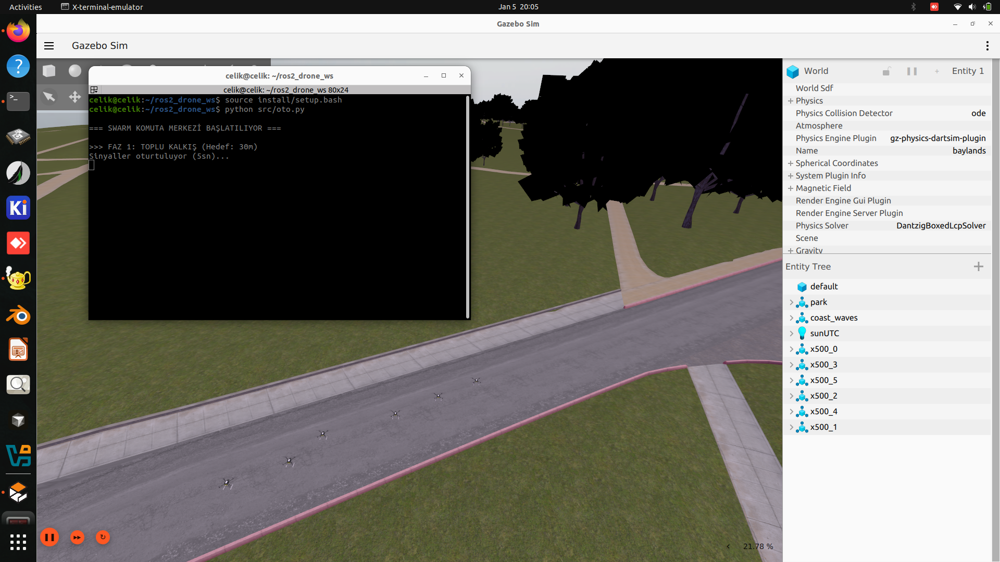
*Şekil 1: Sistem başlatma ve ilk kurulum ekranı*

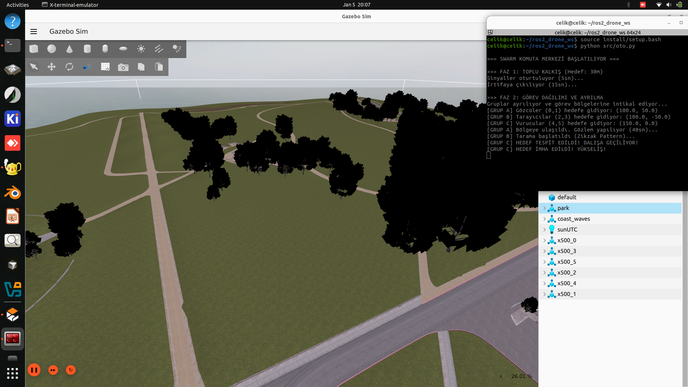
*Şekil 2: Gazebo Harmonic Baylands dünyasının başlatılması*

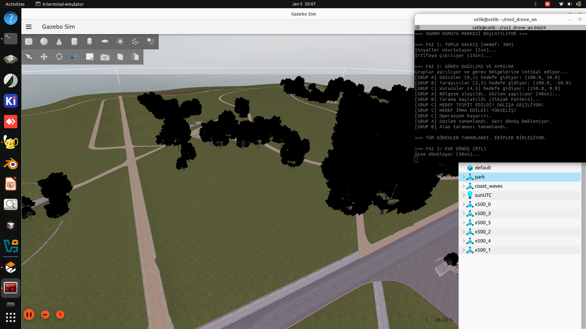
*Şekil 3: Dronların başlangıç pozisyonlarında spawn edilmesi*

### Offboard Kontrol ve Arm

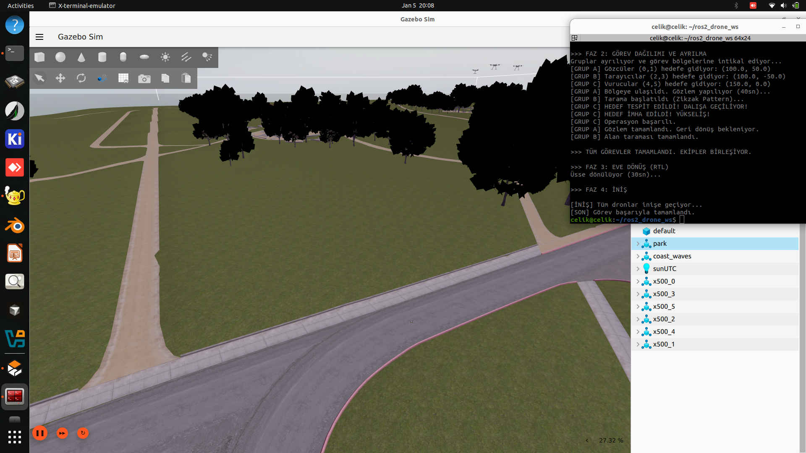
*Şekil 4: Offboard modunun etkinleştirilmesi*

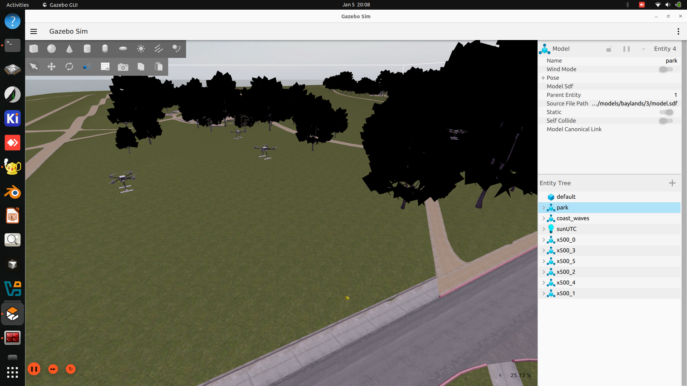
*Şekil 5: Drone'ların arm edilme sırası*

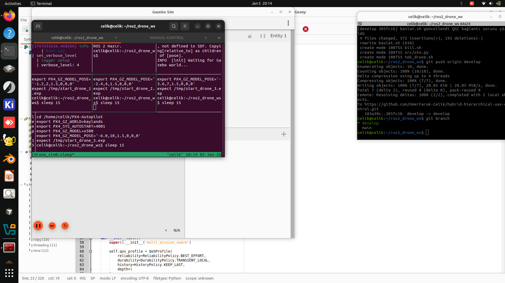
*Şekil 6: Kalkış sekansı ve yüksekliğe çıkış*

### Formasyon ve Hareket

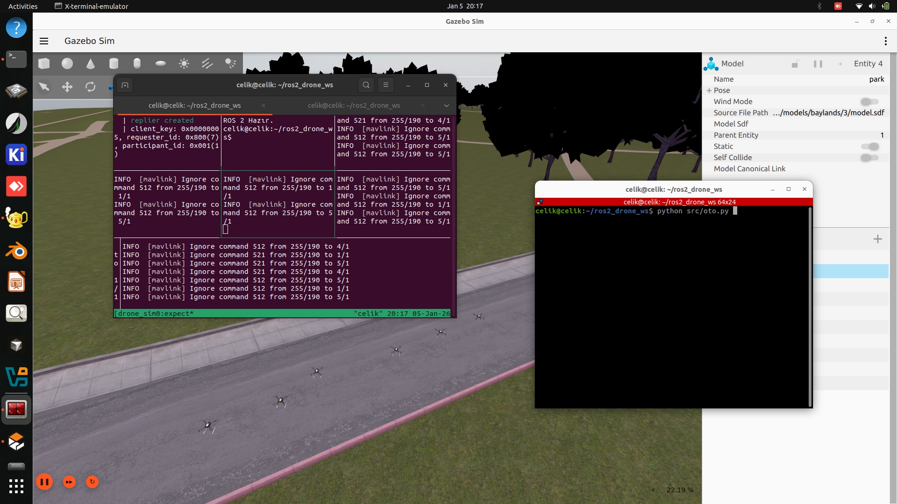
*Şekil 7: Kare formasyon oluşturulması*

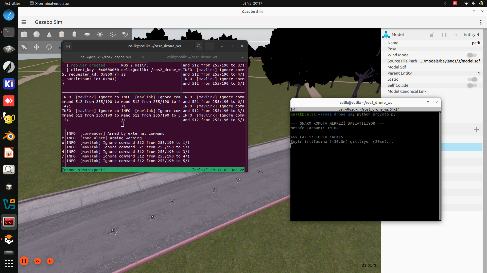
*Şekil 8: Formasyon korunarak hareket*

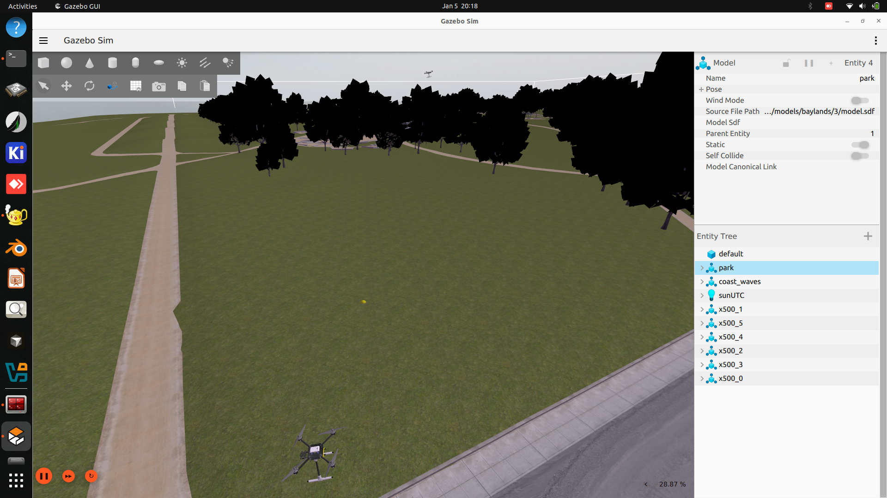
*Şekil 9: Tarama alanına yaklaşım*

### Tarama Görevi

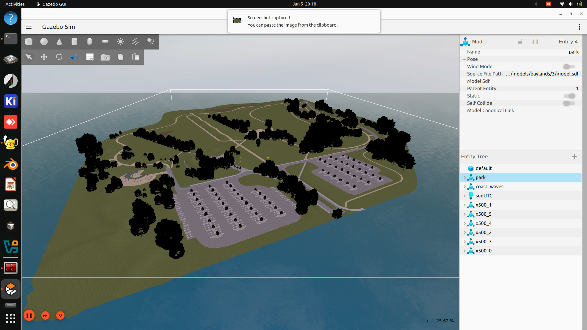
*Şekil 10: Grid pattern ile alan taraması*

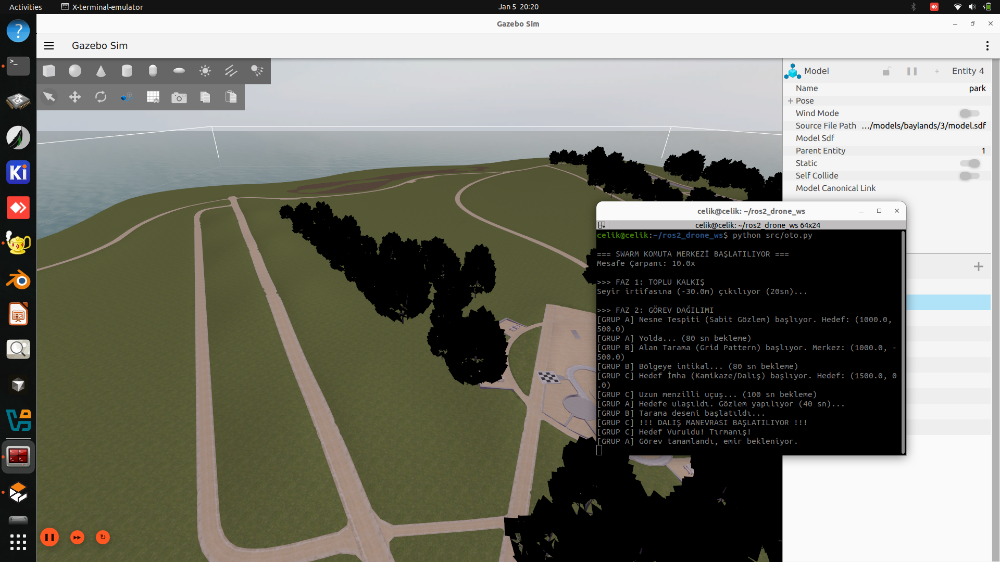
*Şekil 11: Tarama görevinin tamamlanması*

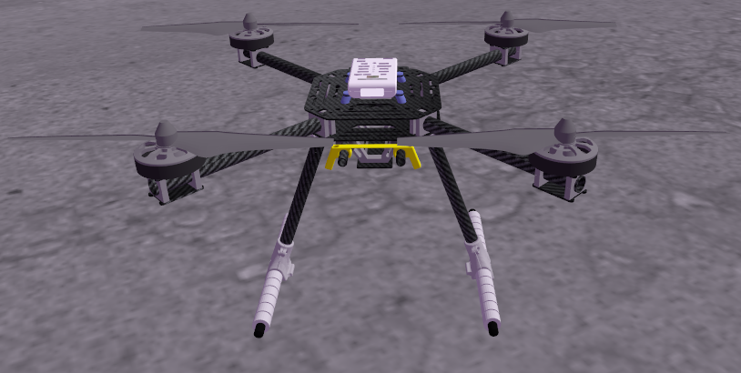
*Şekil 12: Yuvaya dönüş (RTL) sekansı*

### Multi-Mission Senaryoları

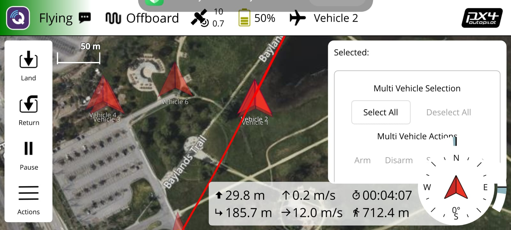
*Şekil 13: Grup A - Nesne tespiti görevi*

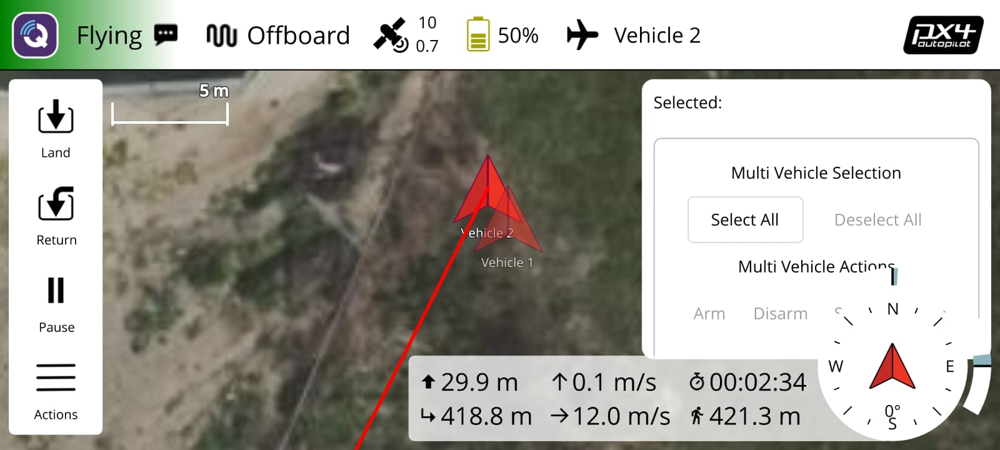
*Şekil 14: Grup B - Alan tarama görevi*

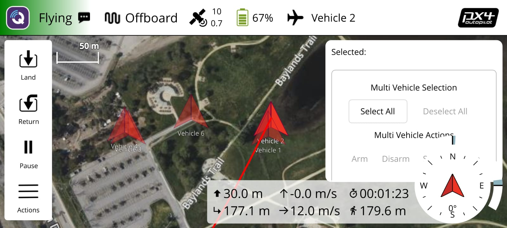
*Şekil 15: Grup C - Hedef imha görevi*

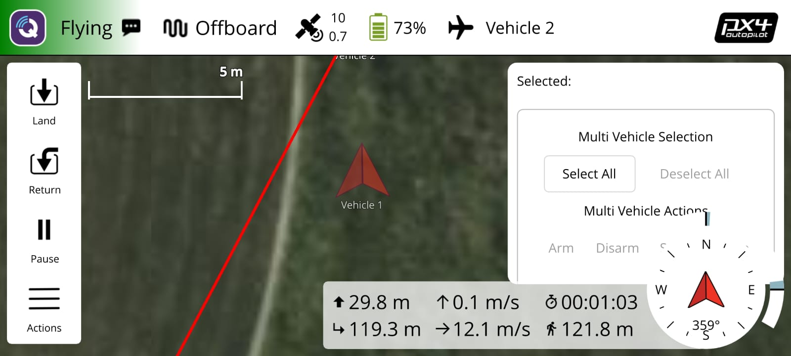
*Şekil 16: Paralel görev yürütme durumu*

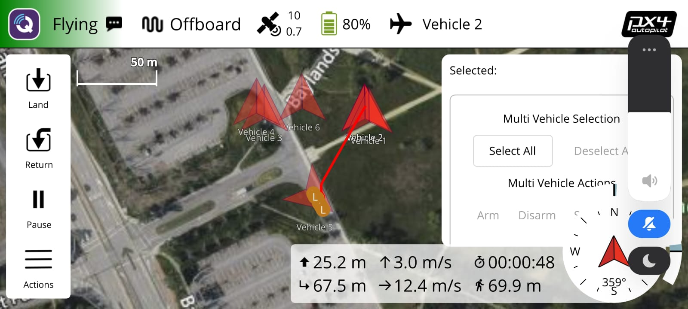
*Şekil 17: Formasyon koordinasyonu*

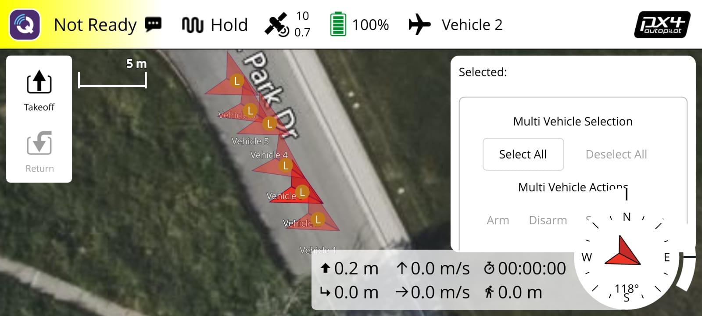
*Şekil 18: Görev tamamlanma durumu*

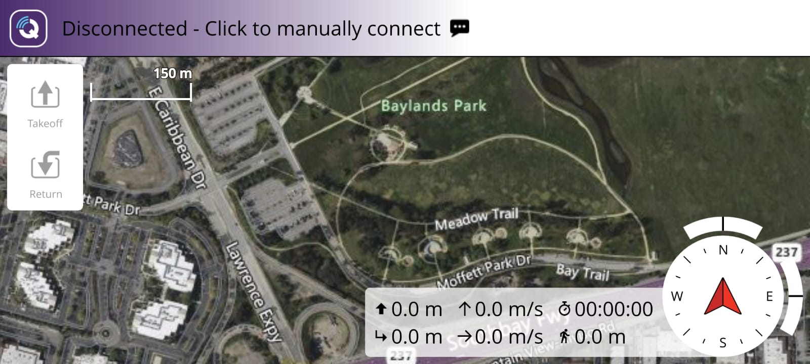
*Şekil 19: Eve dönüş (RTL) sekansı*

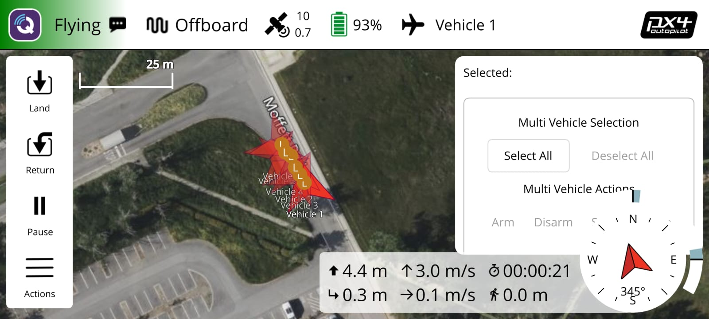
*Şekil 20: İniş sekansı*

### Konsept Görseller


*Şekil 21: AI üretimi konsept görsel 1*


*Şekil 22: AI üretimi konsept görsel 2*


*Şekil 23: AI üretimi konsept görsel 3*

---

## Test Sonuçları

### Başarılı Test Senaryoları

✅ **4 Drone Eş Zamanlı Kontrol**
- Tüm dronlar başarıyla arm edildi
- Offboard moduna geçiş başarılı
- Formasyon oluşturma başarılı

✅ **Grid Pattern Tarama**
- 20m x 20m alan başarıyla tarandı
- Formasyon korunarak hareket edildi
- Tüm waypoint'lere ulaşıldı

✅ **Paralel Multi-Mission**
- 3 grup eş zamanlı görev yürüttü
- Threading ile koordinasyon başarılı
- Eve dönüş ve iniş başarılı

### Bilinen Sorunlar ve Çözümler

⚠️ **Sorun**: Bazı dronlar havalanmıyor
- **Neden**: Namespace veya offboard sinyal zamanlaması
- **Çözüm**: 3 saniye bekleme süresi ve doğru namespace kullanımı

⚠️ **Sorun**: Gazebo başlamıyor
- **Neden**: Eski Gazebo Classic kurulu olabilir
- **Çözüm**: Gazebo Harmonic kurulumu ve `make distclean`

⚠️ **Sorun**: ROS 2 mesajları gelmiyor
- **Neden**: MicroXRCEAgent çalışmıyor veya RMW yanlış
- **Çözüm**: Agent'ı başlat ve `RMW_IMPLEMENTATION=rmw_fastrtps_cpp` kullan

---

## Sorun Giderme

### Gazebo Başlamıyor

```bash
# Gazebo versiyonunu kontrol et
gz sim --version

# Eski derlemeyi temizle
cd ~/PX4-Autopilot
make distclean
make px4_sitl gz_x500
```

### Drone'lar Bağlanmıyor

```bash
# MicroXRCEAgent'ı kontrol et
ps aux | grep MicroXRCEAgent

# ROS 2 topic'lerini kontrol et
source /opt/ros/humble/setup.bash
source ~/ros2_drone_ws/install/local_setup.bash
ros2 topic list

# RMW implementation'ı kontrol et
echo $RMW_IMPLEMENTATION  # rmw_fastrtps_cpp olmalı
```

### Offboard Moduna Geçemiyor

- 3 saniye bekleme süresinin yeterli olduğundan emin olun
- PX4 parametrelerinin doğru ayarlandığını kontrol edin:
  - `NAV_DLL_ACT = 0`
  - `COM_RCL_ACT = 0`
  - `NAV_RCL_ACT = 0`

### Performans Sorunları

- **Yavaş Simülasyon**: CPU/GPU kullanımını kontrol edin
- **Yüksek RAM Kullanımı**: Daha az drone ile test edin
- **Lag**: Gazebo görselleştirmeyi kapatın (headless mode)

---

## Sistem Gereksinimleri

| Bileşen | Minimum | Önerilen |
|---------|---------|-----------|
| **OS** | Ubuntu 20.04 | Ubuntu 22.04 LTS |
| **RAM** | 8GB | 16GB |
| **CPU** | 4 çekirdek | 8+ çekirdek |
| **GPU** | Entegre | Ayrık GPU |
| **Disk** | 20GB boş alan | 50GB boş alan |

---

## Proje Yapısı

```
ros2_drone_ws/
├── src/
│   ├── multi_test.py          # Manuel kontrol scripti
│   ├── oto.py                 # Otomatik multi-mission scripti
│   ├── offboard_test.py       # Tek drone test scripti
│   └── px4_msgs/              # PX4 mesaj tanımları
├── Pictures/                   # Görsel dokümantasyon
│   ├── 01-15_*.png            # Sistem ve görev ekran görüntüleri
│   └── 16-23_*.jpeg           # Multi-mission görselleri
├── baslat.sh                   # Otomasyon başlatma scripti
├── install/                    # Derlenmiş ROS 2 paketleri
├── build/                      # Build dosyaları
└── README.md                   # Bu dosya
```

---

## Kaynaklar ve Referanslar

- [PX4 Documentation](https://docs.px4.io/)
- [ROS 2 Humble Documentation](https://docs.ros.org/en/humble/)
- [Gazebo Harmonic Documentation](https://gazebosim.org/docs)
- [Micro XRCE-DDS](https://micro-xrce-dds.readthedocs.io/)
- [MAVLink Protocol](https://mavlink.io/)

---

## Yazar Bilgileri

**Ömer Faruk Çelik**
- **Öğrenci No**: 220260138
- **Danışman**: Prof. Dr. Gülşah Karaduman
- **Kurum**: Bilgisayar Mühendisliği Tasarım Projesi
- **Tarih**: 2026

---

## Lisans

Bu proje MIT lisansı altında lisanslanmıştır.

---

**Son Güncelleme**: 5 Ocak 2026

**Versiyon**: 2.0 - Multi-Mission Support

---

*İyi çalışmalar! 🚁*
